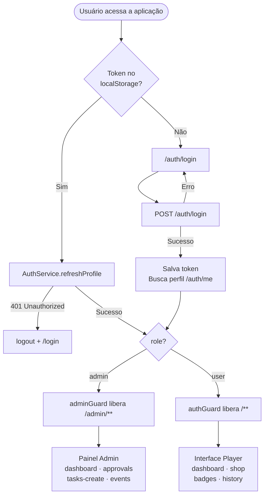
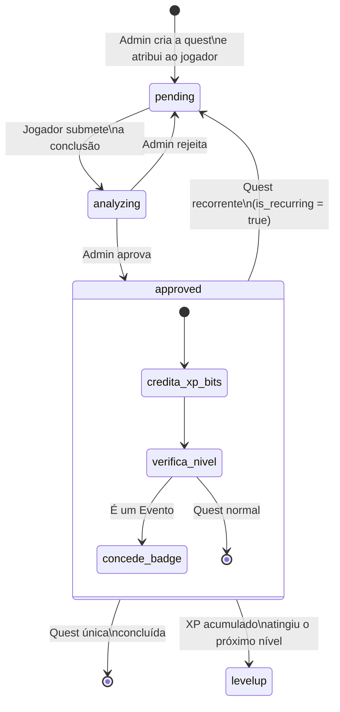

# HomeGuild

Sistema de gamificação doméstica para tarefas do dia a dia. Os administradores (o casal) criam missões e eventos; os jogadores (os enteados) completam tarefas, sobem de nível, acumulam moedas e desbloqueiam recompensas.

---

## Stack

- **Angular 20** — standalone components, signals API, zoneless change detection
- **Tailwind CSS v3 + DaisyUI** — estilização utilitária
- **RxJS** — comunicação com a API via `HttpClient`
- **Backend** — API REST separada (FastAPI), consumida via `ApiService`

---

## Arquitetura

O projeto está organizado em três domínios de produto mais uma camada de infraestrutura compartilhada:

```
src/app/
├── admin/               # Painel dos administradores
│   ├── components/      # badge-preview, header, player-card,
│   │                    # player-picker, sidebar, stat-card
│   └── pages/           # dashboard, approvals, tasks-create,
│                        # events-create, layout
│
├── players/             # Interface dos jogadores
│   ├── components/      # badge-card, header, log-terminal, page-header,
│   │                    # quest-card, reward-card, sidebar, user-card,
│   │                    # xp-bar, auth-card-layout
│   └── pages/           # dashboard, shop, badges, history
│
├── auth/                # Autenticação (neutro de papel)
│   ├── login/
│   └── register/
│
├── guards/              # authGuard, adminGuard
├── interceptors/        # auth.interceptor (injeta Bearer token)
├── interfaces/          # Tipos e DTOs
├── services/            # ApiService, AuthService, UserService,
│                        # QuestService, BadgeService, RewardService,
│                        # GameService, EventService, AdminService
└── layout/              # Shell do player (sidebar + router-outlet)
```

### Separação de responsabilidades

| Camada | Responsabilidade |
|---|---|
| `admin/` | Criação e gestão de quests/eventos, aprovações, analytics |
| `players/` | Visualização de progresso, loja, histórico, badges |
| `auth/` | Login e registro, sem restrição de papel |
| `services/` | Estado global reativo via `signal()`, comunicação com a API |
| `guards/` | Controle de acesso por papel antes de carregar cada rota |

---

## Modelo de Domínio

### Entidades principais

**User**
- `role: 'user' | 'admin'` — determina qual interface é carregada
- `xp`, `level`, `bits` — métricas de progresso em tempo real

**Quest**
- `status: 'pending' | 'analyzing' | 'approved'`
- Contém a recompensa prometida (`xp` + `bits`) definida na criação pelo admin

**Badge**
- `rarity: 'comum' | 'raro' | 'lendario'`
- Concedidas por eventos especiais criados pelos admins

**Reward**
- `type: 'bits' | 'milestone'`
- Recompensas de bits exigem saldo mínimo; recompensas de milestone exigem nível mínimo

**GameLog**
- Registro imutável de todos os eventos do jogo (aprovações, level-ups, resgates)
- `type: 'info' | 'approved' | 'rejected' | 'analyzing' | 'levelup' | 'downgrade' | 'error'`

---

## Regras de Negócio

### Progressão

| Constante | Valor |
|---|---|
| XP por nível | 1.000 |
| Nível máximo | 15 |
| Total de badges disponíveis | 24 |
| Milestone ouro | Nível 15 |
| Milestone prata | Nível ≥ 10 |

### Quests

- Quests são criadas pelos admins e atribuídas a jogadores específicos (ou todos)
- Podem ser recorrentes (`is_recurring: true`), reaparecendo após aprovação
- O jogador submete a conclusão → status vai para `analyzing`
- O admin aprova ou rejeita; em caso de aprovação, o backend credita XP e bits e pode disparar level-up
- Rejeições não penalizam — a quest volta para `pending`

### Eventos

- Eventos são quests especiais que carregam um badge embutido
- O admin define título, raridade e imagem do badge no momento da criação
- Ao aprovar um evento, o backend concede o badge ao jogador além do XP e bits

### Loja (Rewards)

- Recompensas do tipo `bits` exigem saldo suficiente na conta do jogador
- Recompensas do tipo `milestone` são desbloqueadas automaticamente ao atingir o nível mínimo
- Uma vez resgatada, a recompensa não pode ser resgatada novamente (`redeemed: true`)

---

## Fluxo de Autenticação e Roteamento



---

## Ciclo de Vida de uma Quest



---

## Papéis

### Admin
Acessa `/admin/**`, protegido por `adminGuard` (verifica `role === 'admin'`).

- **Dashboard**: visão geral do sistema — total de players, quests aprovadas/reprovadas/pendentes e métricas individuais de cada jogador
- **Approvals**: fila de quests aguardando análise — aprova ou rejeita com um clique
- **Tasks Create**: cria quests para um ou mais jogadores, define XP, bits e se é recorrente
- **Events**: cria quests especiais com badge embutido (título, raridade, imagem)

### Player
Acessa `/**`, protegido por `authGuard` (verifica autenticação).

- **Dashboard**: quests ativas, card de perfil com XP/nível/bits e log de eventos em tempo real
- **Shop**: catálogo de recompensas; o jogador resgata com bits ou por milestone de nível
- **Badges**: coleção de badges conquistados, com visualização de raridade
- **History**: histórico completo de logs do jogo (aprovações, level-ups, resgates)
